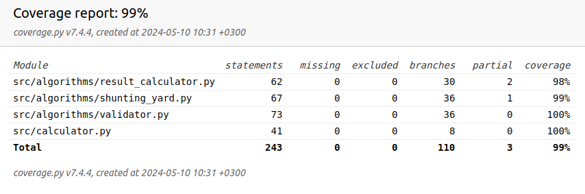

# Testausdokumentti

Sovellusta testataan automatisoiduin yksikkö- ja integraatiotestein unittestilla. Lisäksi sovellusta testataan manuaalisesti käyttäjän näkökulmasta käyttöliittymän kautta. 

## Testit

Testausta on tehty kattavasti Validator-, ShuntingYard- ja ResultCalculator -luokille, jotka vastaavat oikeastaan kaikista tarkistuksista ja ohjelman ytimestä. Validator ja shunting yardille on tehty omia yksikkötestejä. Mutta projektin loppua kohden on keskitytty tekemään läpiohjelman testejä CalculatorTest -luokan kautta.  

Käyttöliittymä on jätetty automatisoitujen testien ulkopuolelle. 

Testattujen luokkien metodeille on pyritty luomaan testit sitä mukaan, kun metodi on saatu valmiiksi. Näin ongelmatapaukset havaitaan varhaisessa vaiheessa. Testeissä pyritään käyttämään monipuolisesti erilaisia syötteitä, sekä hyväksyttäviä että hylättäviä. 

Esimerkiksi Validator-luokkaa, joka ottaa syötteeksi String-tyyppisen infix muotoisen lausekkeen, on testattu seuraavanlaisesti:
- Osaa tunnistaa lukuarvot, oli siinä yksi tai useampi numero
- Osaa tunnistaa lukuarvot, jotka sisältävät desimaalierottimen, erottimia ei voi olla myöskään kuin yksi ja erotin ei voi olla viimeinen merkki eli sen jälkeen täytyy olla ainakin yksi numero
- Osaa tunnistaa laskuoperaatiot
- Osaa tunnistaa oikeat funktiot ja hylätä sellaiset funktiot joita ei ole olemassa
- Osaa tunnistaa tallennetut muuttujat ja hylätä sellaiset joita ei ole tallennettu
- jne.

Shunting yard -luokkaa, joka ottaa syötteeksi deque-tyyppisen infix muotoisen lausekkeen on testattu myös hieman vastaavilla testeillä kuin Validator-luokkaa.

Testauksen painopiste on testata Calculator-luokkaa, joka vastaa ohjelman toimintalogiikasta. Luokka käyttää kaikkia muita luokkia, joten testit kattavat periaatteessa koko ketjun alusta loppuun. Testauksen kattavuus saatiin hyvälle tasolle, kun logiikasta ja algoritmeista vastaavien luokkien testauskattavuus on 98-100% luokkaa. 

## Testauskattavuus

Testien haarautuvuuskattavuus pyritään myös pitämään mahdollisimman korkealla, niin että kaikki luokat, metodit, ehto-lauseet ym. tulee testattua. 

Viimeisin testauskattavuusraportti: 



## Testien suoritus

Testien ajo:

```bash
poetry run pytest src
```

Testien ajo ja testikattavuusraportin luonti:

```bash
poetry run coverage run --branch -m pytest src; coverage html
```